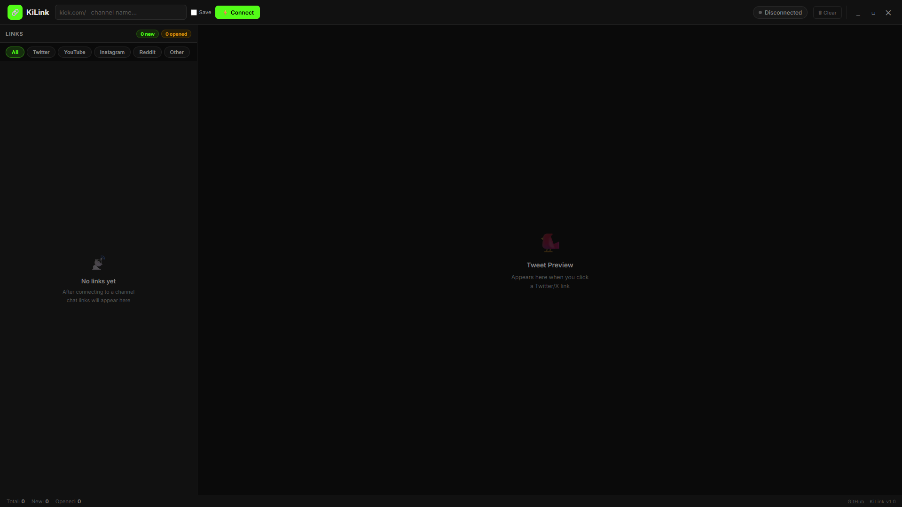

# KiLink — Chat Link Collector 🔗

**KiLink** is a lightweight, modern desktop application built to monitor [Kick.com](https://kick.com) streams and extract URLs posted in the chat in real-time. Designed with streamers, moderators, and viewers in mind, KiLink captures all shared links so you never miss out on important content during a fast-moving chat.

## ✨ Features

- **Real-Time Monitoring:** Directly connects to Kick.com's Pusher WebSocket infrastructure to instantly catch messages containing URLs.
- **Auto-Categorization:** Automatically filters incoming links by platform (Twitter/X, YouTube, Instagram, Reddit, and Other) for easy browsing.
- **Embedded Previews:** Click on any Twitter/X link to instantly see an embedded preview right inside the app, without opening a browser.
- **Read/Unread Tracking:** Keeps track of which links you have already opened (`opened`) and which ones are brand new (`new`).
- **Persistent Memory:** Saves your last connected channel and remembers it for your next session.
- **Custom Frameless Design:** Built with a sleek, dark UI featuring "Kick Green" highlights and fully custom frameless window controls.

## 🛠️ Technologies Used

- **Backend:** Python 3, `pywebview`, `websocket-client`, `requests`
- **Frontend:** Vanilla HTML5, CSS3, JavaScript
- **Architecture:** Local Python process serving an embedded Chromium/Edge HTML instance, communicating via bidirectional JS bridges.

## 🚀 Installation & Setup

1. Download the latest `KiLink.exe` file from the **Releases** page.
2. Place the `.exe` file in your preferred folder.
3. Run the application! No installation or Python setup is required.

## 🎮 Usage

1. Open **KiLink**.
2. In the top right corner, enter the username of the Kick channel you want to monitor (e.g., `xqc`, `trainwreckstv`).
3. Check **"Remember channel"** if you want the app to automatically connect to this channel on your next startup.
4. Click **Connect**.
5. As viewers post links in the chat, they will appear in the left panel. Use the filter buttons to sort them, and click on any card to view the link.

## 🤝 Contributing

Contributions, issues, and feature requests are welcome! Feel free to check the [issues page](https://github.com/Bohjka/KiLink/issues) if you want to contribute.

## 📄 License

This project uses a **Custom License**. It is free for personal and educational use, but commercial use, modification, or redistribution is strictly prohibited. See the [LICENSE](LICENSE) file for the full Terms of Use.

---
*Created by [Bohjka](https://github.com/Bohjka)*
